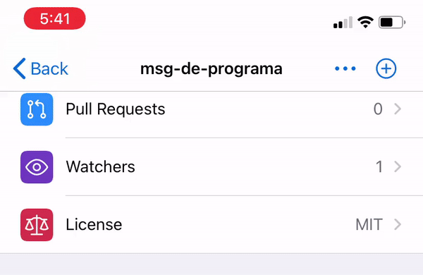

<h1 align="center">msg-de-programa</h1>
<p>
  <a href="https://github.com/Odin-son/msg-de-programa/master/LICENSE" target="_blank">
    
  </a>
</p>

> message from program
>
> 

## Author

👤 **Changwoo Song**

* Github: [@Odin-son](https://github.com/Odin-son)
* LinkedIn: [@mdsd12](https://linkedin.com/in/mdsd12)

## Requirements
* twitter account
    * registered developer [@how_to_apply](https://blog.naver.com/mdsd12) (not yet)
* library
    * tweepy==3.9.0
    * os
    * json

## Getting Started
* in case of using virtualenv,
```bash
$ virtualenv [env_name] --python=python3.7
$ source [en_name]/bin/activate
```
* in case of using anaconda,
```bash
$ conda create -n [env_name] python=3.7
$ conda activate [env_name]
```
* install required library(CLI)
```
$ bash ./lib_install.sh 
```

## How to use
* in your code, just call `msg()` function
```
# load package, 'msg-de-programa'
from mensaje.operate import *
...
# for example, when the loop statement is done
msg('[TEST-01, LOOP] finally done!')
...
```


## Troubleshooting
* just in case of bad auth, re-check your dev-api reference (ex)

## 📝 License

Copyright © 2020 [Changwoo Song](https://github.com/Odin-son).
This project is [MIT](https://github.com/Odin-son/msg-de-programa/master/LICENSE) licensed.